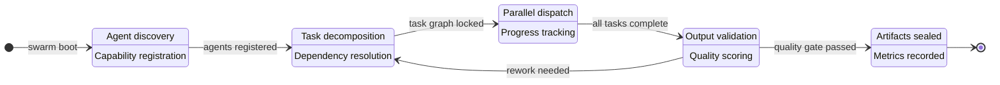
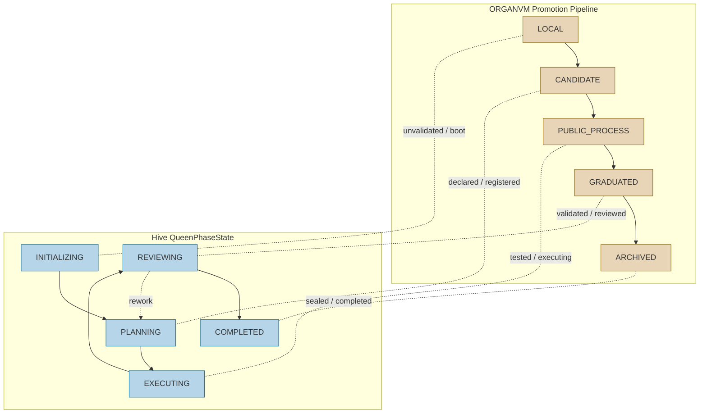

# State Transition Comparison Diagrams

**Backflow deposit:** ORGAN-II (Generative)
**Source workspace:** contrib--adenhq-hive
**Date:** 2026-03-23

Mermaid diagrams comparing the lifecycle state machines of ORGANVM and Hive (AdenHQ). These emerged from the contribution campaign's cross-system governance analysis: when preparing a governance PR for Hive, the structural parallels between the two promotion models became diagrammatically obvious.

---

## Diagram A: ORGANVM Promotion FSM

The ORGANVM system uses a five-state forward-only promotion pipeline. No state may be skipped. Back-transitions are forbidden by governance-rules.json Article VI.

```mermaid
stateDiagram-v2
    direction LR

    [*] --> LOCAL : repo created
    LOCAL --> CANDIDATE : seed.yaml + CI green
    CANDIDATE --> PUBLIC_PROCESS : docs + tests + stranger test
    PUBLIC_PROCESS --> GRADUATED : community validation
    GRADUATED --> ARCHIVED : deprecation vote

    LOCAL : Unvalidated
    LOCAL : No CI, no docs
    CANDIDATE : CI passing
    CANDIDATE : seed.yaml declared
    PUBLIC_PROCESS : Docs complete
    PUBLIC_PROCESS : Stranger-tested
    GRADUATED : Full production
    GRADUATED : Community-verified
    ARCHIVED : Read-only
    ARCHIVED : Historical record
```

---

## Diagram B: Hive QueenPhaseState

Hive's `QueenBee` agent uses a four-phase lifecycle for swarm coordination. Each phase gates which agent behaviors are permitted. The `QueenPhaseState` enum controls this gating.

---

## Diagram C: Unified Structural Parallels

Both systems enforce forward-only progression through validation gates. The parallelism is not accidental — both solve the same coordination problem (how to promote work through stages of increasing trust) and arrive at structurally isomorphic solutions.

### Structural Observations

1. **Gate count:** Both systems use 4-5 gates. This is not coincidence — it reflects a natural decomposition of trust-building: existence, declaration, validation, community acceptance, completion.

2. **Directionality:** ORGANVM is strictly forward-only (no back-edges by governance rule). Hive allows one back-transition (REVIEWING to PLANNING for rework). This difference encodes different failure philosophies: ORGANVM treats demotion as a new entity; Hive treats it as iteration.

3. **Terminal states:** Both have a terminal sealed state (ARCHIVED / COMPLETED) where the artifact becomes read-only historical record. This is the governance equivalent of immutability.

4. **Portability thesis:** The structural isomorphism suggests that lifecycle state machines are a universal coordination pattern, not a project-specific invention. Any system managing work through stages of increasing trust will converge on a similar shape.
