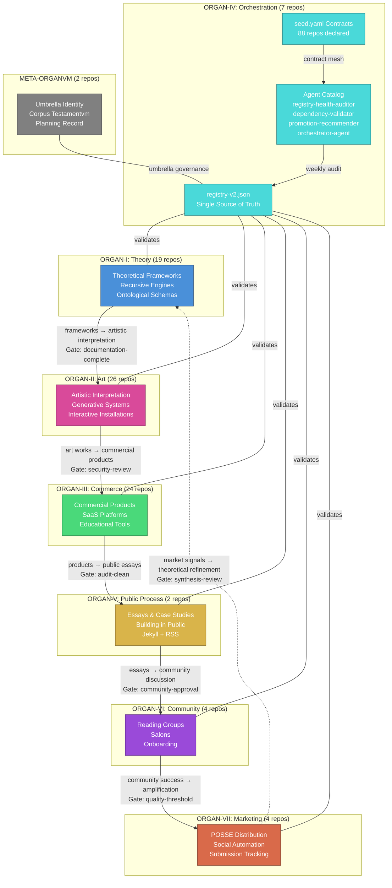
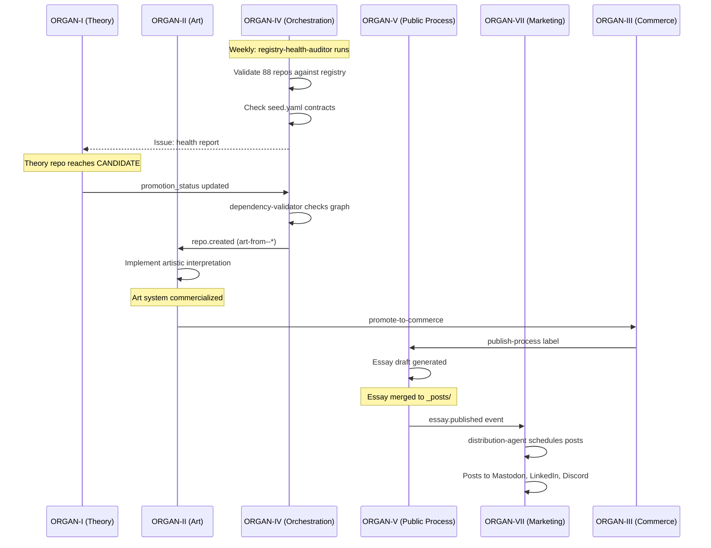

# Autonomous Systems Design: The ORGAN Metasystem

**Version:** 1.0.0
**Status:** Design Document
**Author:** @4444j99
**Date:** 2026-02-12
**Deployment Target:** `organvm-iv-taxis/orchestration-start-here` at `docs/autonomous-systems-design.md`
**Scope:** 88 GitHub repositories across 8 organizations (organvm-i-theoria through organvm-vii-kerygma + meta-organvm)

---

## 1. Executive Summary

The ORGAN metasystem coordinates 88 GitHub repositories across 8 organizations — seven functional organs (Theory, Art, Commerce, Orchestration, Public Process, Community, Marketing) plus one umbrella meta-org. Each organ serves a distinct role in a creative-institutional pipeline: theoretical frameworks become art, art becomes commerce, commerce generates documentation, documentation feeds community, and community drives amplification. ORGAN-IV (Taxis) orchestrates the entire flow.

This document specifies the autonomous systems architecture that governs inter-organ content flow, enforces quality gates at every boundary, and enables a catalog of software agents to maintain system coherence without continuous human intervention.

The architecture rests on three primitives:

1. **`seed.yaml` contracts** — every repository declares what it produces and consumes, creating a machine-readable dependency mesh across all 88 repos.
2. **Quality gates** — typed validation checks enforced at every inter-organ boundary, preventing degraded content from propagating downstream.
3. **Autonomous agents** — GitHub Actions workflows and scheduled jobs that read seed.yaml contracts, enforce gates, and perform maintenance operations (audits, promotions, distribution).

The system is already partially deployed. The `registry-health-audit.yml` workflow runs weekly at orchestration-start-here. The `seed.yaml` schema (v1.0) is defined and deployed to the orchestration hub. This document specifies the complete target architecture, from the already-deployed foundation through the full agent catalog and event-driven content flow.

**Key constraints from the project constitution:**

- `registry-v2.json` is the single source of truth (Article I)
- Dependencies flow unidirectionally: I -> II -> III only (Article II)
- Documentation precedes deployment (Article IV)
- Every README is a portfolio piece (Article V)
- Promotion follows a formal state machine: LOCAL -> CANDIDATE -> PUBLIC_PROCESS -> GRADUATED -> ARCHIVED (Article VI)

---

## 2. The seed.yaml Contract System

### 2.1 Design Rationale

Each of the 88 repositories in the ORGAN system participates in a network of producer-consumer relationships. Without a machine-readable contract, these relationships exist only in prose documentation and human memory — neither of which scales. The `seed.yaml` contract makes every repository's inputs, outputs, quality obligations, and automation triggers explicit and validatable.

The name "seed" is deliberate: each repo's contract is the seed from which its role in the ecosystem grows. The orchestrator-agent reads all 88 seed files to construct the complete system graph.

### 2.2 Schema Definition (v1.0)

```yaml
# seed.yaml — Repository Automation Contract
# Schema: v1.0
# Location: root of every repository

schema_version: "1.0"
organ: "ORGAN-I"                          # Which organ this repo belongs to
repo: "recursive-engine--generative-entity"
org: "organvm-i-theoria"

produces:
  - type: "theoretical-framework"         # Semantic type of output
    format: "python-package"              # Concrete format
    consumers:                            # Who consumes this output
      - organ: "ORGAN-II"
        repos: ["art-from--auto-revision-epistemic-engine"]
        relationship: "implements"
      - organ: "ORGAN-V"
        repos: ["public-process"]
        relationship: "documents"
    quality_gates:                         # Outbound gates (sender responsibility)
      - gate: "documentation-complete"
      - gate: "security-review"

consumes:
  - type: "ontological-schema"
    source:
      organ: "ORGAN-I"
      repo: "organon-noumenon--ontogenetic-morphe"
    trigger: "on_release"                 # When to pull updates
    quality_gates:                         # Inbound gates (receiver responsibility)
      - gate: "no-back-edges"
      - gate: "registry-valid"

agents:
  - name: "ci-validate"
    trigger: "on_push"
    workflow: "ci-python.yml"
    description: "Run tests and linting on every push"
  - name: "dependency-check"
    trigger: "on_push"
    workflow: "validate-dependencies.yml"
    description: "Validate inter-organ dependency graph on PR"
  - name: "health-report"
    trigger:
      schedule: "0 6 * * 1"              # Weekly Monday 06:00 UTC
    workflow: "registry-health-audit.yml"
    description: "Weekly registry consistency validation"

subscriptions:
  - event: "release.created"
    source_organ: "ORGAN-I"
    source_repo: "organon-noumenon--ontogenetic-morphe"
    action: "trigger-integration-test"
  - event: "essay.published"
    source_organ: "ORGAN-V"
    action: "update-cross-references"

metadata:
  implementation_status: "PRODUCTION"
  tier: "flagship"
  last_validated: "2026-02-12"
  promotion_status: "PUBLIC_PROCESS"
```

### 2.3 Schema Field Reference

| Field | Required | Type | Description |
|-------|----------|------|-------------|
| `schema_version` | Yes | string | Semver of the seed.yaml schema |
| `organ` | Yes | string | Organ identifier (ORGAN-I through ORGAN-VII, META-ORGANVM) |
| `repo` | Yes | string | Repository name (matches registry-v2.json) |
| `org` | Yes | string | GitHub organization slug |
| `produces[]` | No | array | Outputs this repo creates for other organs |
| `produces[].type` | Yes | string | Semantic type (e.g., "theoretical-framework", "art-work", "commercial-product") |
| `produces[].format` | Yes | string | Concrete format (e.g., "python-package", "static-site", "essay-markdown") |
| `produces[].consumers[]` | No | array | Downstream consumers |
| `produces[].quality_gates[]` | No | array | Outbound validation checks |
| `consumes[]` | No | array | Inputs this repo requires from other organs |
| `consumes[].trigger` | Yes | string | When to pull updates: `on_release`, `on_push`, `schedule`, `manual` |
| `consumes[].quality_gates[]` | No | array | Inbound validation checks |
| `agents[]` | No | array | Automated workflows associated with this repo |
| `agents[].trigger` | Yes | string or object | `on_push`, `on_release`, `on_pr`, or `{ schedule: "cron" }` |
| `subscriptions[]` | No | array | Cross-organ event listeners |
| `metadata` | Yes | object | Must mirror registry-v2.json fields |

### 2.4 Deployed Reference: orchestration-start-here

The canonical seed.yaml is deployed at `organvm-iv-taxis/orchestration-start-here/seed.yaml`. This file declares orchestration-start-here as the system's central nervous system — consuming registry data from all 88 repos and producing governance validations, health reports, and promotion decisions. All other repos' seed.yaml files should reference this contract as the authoritative example.

### 2.5 Invariant: seed.yaml Must Agree with registry-v2.json

The `metadata` block in every seed.yaml must be consistent with the corresponding entry in `registry-v2.json`. The `orchestrator-agent` validates this invariant on every run. If seed.yaml and registry disagree, the registry wins (Article I of the constitution). The seed.yaml is then flagged for update.

---

## 3. Inter-Organ Content Flow Architecture

### 3.1 The Six Primary Edges

Content flows through the ORGAN system along six directed edges, forming a cycle that feeds back from market signals to theoretical refinement. ORGAN-IV oversees all flows without participating in the content pipeline directly.

**Edge 1: ORGAN-I (Theory) -> ORGAN-II (Art)**

- **What flows:** Theoretical frameworks, recursive engines, ontological schemas, epistemic models
- **Transformation:** Abstract theory becomes artistic interpretation — interactive installations, generative performances, experiential systems
- **Trigger:** ORGAN-I repo reaches CANDIDATE promotion status; ORGAN-II maintainer accepts implementation
- **Example:** `recursive-engine--generative-entity` (I) -> `art-from--auto-revision-epistemic-engine` (II): governance visualization as interactive art installation
- **Outbound gate (I):** `documentation-complete` — framework must have full API docs, usage examples, and theoretical grounding essay
- **Inbound gate (II):** `no-back-edges` — art implementation must not create runtime dependency back to theory source

**Edge 2: ORGAN-II (Art) -> ORGAN-III (Commerce)**

- **What flows:** Art works, generative systems, performance platforms, experiential engines
- **Transformation:** Artistic systems become commercial products — SaaS platforms, educational tools, licensing-ready works
- **Trigger:** ORGAN-II repo labeled `ready-for-commercialization`; ORGAN-III evaluates business model
- **Outbound gate (II):** `quality-threshold` — art system must have documented use cases, stable API, and brand guideline compliance
- **Inbound gate (III):** `security-review` — commercial product must pass dependency vulnerability scan and secrets scan

**Edge 3: ORGAN-III (Commerce) -> ORGAN-V (Logos)**

- **What flows:** Product documentation, retrospectives, metrics, methodology, lessons learned
- **Transformation:** Commercial operations become public essays — case studies, post-mortems, building-in-public narratives
- **Trigger:** Issue labeled `publish-process` in commerce repo; `publish-process.yml` workflow creates essay draft
- **Outbound gate (III):** `audit-clean` — latest health audit must pass; no unresolved security issues
- **Inbound gate (V):** `synthesis-review` — essay draft must include human-written synthesis with actionable insights, not raw AI-generated text

**Edge 4: ORGAN-V (Logos) -> ORGAN-VI (Koinonia)**

- **What flows:** Published essays, guides, case studies, methodology documentation
- **Transformation:** Essays become community discussion material — reading group curricula, salon topics, workshop prompts
- **Trigger:** Essay published to Jekyll site; `essay.published` event fires
- **Outbound gate (V):** `documentation-complete` — essay must have proper frontmatter, cross-references, and RSS entry
- **Inbound gate (VI):** `community-approval` — community facilitator confirms topic is appropriate for current cohort

**Edge 5: ORGAN-VI (Koinonia) -> ORGAN-VII (Kerygma)**

- **What flows:** Community success stories, engagement metrics, participation data, testimonials
- **Transformation:** Community engagement becomes marketing amplification — social posts, newsletter features, case studies
- **Trigger:** Community milestone reached (new cohort, reading group completion, salon series wrapped)
- **Outbound gate (VI):** `community-approval` — members consent to public sharing of their participation
- **Inbound gate (VII):** `quality-threshold` — marketing content must follow brand guidelines and POSSE methodology

**Edge 6: ORGAN-VII (Kerygma) -> ORGAN-I (Theory) [Feedback Loop]**

- **What flows:** Market signals, audience engagement data, distribution metrics, request patterns
- **Transformation:** Audience response informs theoretical refinement — which frameworks resonate, what questions arise, where gaps exist
- **Trigger:** Quarterly review of distribution-strategy analytics; manual synthesis
- **Outbound gate (VII):** `audit-clean` — analytics data must be verified, not aspirational
- **Inbound gate (I):** `synthesis-review` — theoretical refinement must cite specific market signals, not vague trends

### 3.2 ORGAN-IV as Overseer

ORGAN-IV (Taxis) does not participate in the content pipeline. It sits above all six edges, performing three functions:

1. **Validation:** The `dependency-validator` agent checks every proposed connection against the dependency graph. No back-edges. No circular dependencies. Transitive depth <= 4.
2. **Promotion:** The `promotion-recommender` agent scans repos monthly and identifies candidates for state-machine advancement (DESIGN_ONLY -> SKELETON -> PROTOTYPE -> PRODUCTION).
3. **Health:** The `registry-health-auditor` agent runs weekly, validating that all 88 repos are consistent with registry-v2.json and that no seed.yaml contracts have drifted from reality.

### 3.3 META-ORGANVM as Umbrella

meta-organvm holds the system-wide identity and the corpus testamentvm (this planning record). It does not route content. It provides the institutional frame — the org profile that grant reviewers, hiring managers, and collaborators see first.

---

## 4. Autonomous Agents Catalog

Each agent is a GitHub Actions workflow with a defined trigger, scope, and output. Agents read from seed.yaml contracts and registry-v2.json; they write to GitHub Issues, PRs, and (where authorized) the registry itself.

### 4.1 ORGAN-IV (Orchestration) Agents

**`registry-health-auditor`** -- DEPLOYED

- **Workflow:** `registry-health-audit.yml` at `orchestration-start-here`
- **Trigger:** `schedule: "0 6 * * 1"` (weekly Monday 06:00 UTC) + `workflow_dispatch`
- **Scope:** All 88 repos in registry-v2.json
- **Actions:** Validates JSON schema consistency, checks `implementation_status_distribution` totals, verifies all repos are reachable via GitHub API, flags repos with stale `last_validated` dates (>30 days)
- **Output:** GitHub Issue with health report; updates `audit_history[]` in registry-v2.json
- **Failure mode:** If registry is unreachable, opens critical alert issue and exits non-zero

**`dependency-validator`** -- DESIGN PHASE

- **Workflow:** `validate-dependencies.yml` (template deployed to repos with `.meta/dependencies.json`)
- **Trigger:** `on: pull_request` (paths: `.meta/dependencies.json`, `seed.yaml`, `package.json`, `requirements.txt`, `Cargo.toml`)
- **Scope:** Single repo per invocation; validates against central registry
- **Actions:** Fetches registry-v2.json from orchestration-start-here, builds directed graph, checks for cycles, validates no back-edges (III -> II, II -> I are forbidden), enforces transitive depth <= 4
- **Output:** PR comment with validation results; blocks merge on failure
- **Failure mode:** If central registry is unreachable, warns but does not block (graceful degradation)

**`promotion-recommender`** -- DESIGN PHASE

- **Workflow:** `promotion-recommender.yml` at `orchestration-start-here`
- **Trigger:** `schedule: "0 8 1 * *"` (monthly 1st, 08:00 UTC) + `workflow_dispatch`
- **Scope:** All 88 repos
- **Actions:** For each repo, evaluates promotion readiness based on:
  - DESIGN_ONLY -> SKELETON: repo has README.md + LICENSE + at least one substantive file
  - SKELETON -> PROTOTYPE: repo has tests, CI workflow green, `>= 500` lines of source
  - PROTOTYPE -> PRODUCTION: repo has full README (>2,000 words), CI green for 7+ days, no open security alerts, documentation_status is DEPLOYED or FLAGSHIP
- **Output:** GitHub Issue listing promotion candidates with evidence; human reviews and approves
- **Failure mode:** Conservative — never auto-promotes; only recommends

**`orchestrator-agent`** -- DESIGN PHASE

- **Workflow:** `orchestrator-agent.yml` at `orchestration-start-here`
- **Trigger:** `schedule: "0 7 * * 1"` (weekly Monday 07:00 UTC, one hour after health audit) + `workflow_dispatch`
- **Scope:** All repos with `seed.yaml` deployed
- **Actions:**
  1. Clones or fetches `seed.yaml` from every repo in registry-v2.json
  2. Builds the complete producer-consumer graph
  3. Validates all contracts: does every declared consumer actually exist? Does every declared producer have at least one consumer?
  4. Detects orphaned repos (no produces, no consumes — isolated from the system)
  5. Detects missing connections (producer exists but no consumer has declared it)
  6. Validates seed.yaml `metadata` blocks against registry-v2.json
- **Output:** System graph report as GitHub Issue; highlights contract violations, orphans, and drift
- **Failure mode:** If >10% of repos lack seed.yaml, reports coverage gap instead of failing

### 4.2 ORGAN-V (Public Process) Agents

**`essay-monitor`** -- DESIGN PHASE

- **Workflow:** `essay-monitor.yml` at `public-process`
- **Trigger:** `schedule: "0 9 * * 5"` (weekly Friday 09:00 UTC)
- **Scope:** All 8 orgs — scans recent commits, PRs, issues, releases
- **Actions:** Aggregates system activity for the past 7 days, identifies potential essay topics:
  - New promotions (CANDIDATE -> PUBLIC_PROCESS)
  - Significant releases (semver major/minor)
  - Cross-organ dependencies added or removed
  - Repos crossing implementation status thresholds
- **Output:** GitHub Issue in `public-process` with suggested essay topics and supporting evidence
- **Failure mode:** If GitHub API rate-limited, reports partial results

**`sprint-narrator`** -- DESIGN PHASE

- **Workflow:** `sprint-narrator.yml` at `public-process`
- **Trigger:** `workflow_dispatch` (manual, invoked at end of each sprint)
- **Scope:** All repos with activity since last invocation
- **Actions:**
  1. Collects git log summaries across all active repos
  2. Aggregates metrics: repos promoted, words written, CI workflows added, essays published
  3. Generates a structured sprint narrative draft using the established format (sprint name, scope, outcomes, metrics delta)
- **Output:** PR in `public-process` with draft essay in `_posts/` directory
- **Failure mode:** If metrics collection fails for any org, includes partial data with warning

### 4.3 ORGAN-VI (Community) Agents

**`reading-list-curator`** -- DESIGN PHASE

- **Workflow:** `reading-list-curator.yml` at `reading-group-curriculum`
- **Trigger:** `on: repository_dispatch` (fired by `essay.published` event from ORGAN-V)
- **Scope:** New essays published in public-process
- **Actions:**
  1. Reads essay frontmatter (tags, organ, topic)
  2. Matches against active reading group curricula
  3. Generates discussion prompts tailored to the essay's content
  4. Creates PR in `reading-group-curriculum` with updated curriculum entry
- **Output:** PR with discussion prompts and reading list update
- **Failure mode:** If essay lacks frontmatter tags, creates generic prompt with manual review flag

**`onboarding-guide`** -- DESIGN PHASE

- **Workflow:** `onboarding-guide.yml` at `salon-archive`
- **Trigger:** `on: issues` (labeled `new-member`)
- **Scope:** Single new contributor
- **Actions:**
  1. Reads contributor's stated interests from issue body
  2. Matches interests against organ domains and repo descriptions in registry-v2.json
  3. Generates personalized onboarding path: 3-5 repos to explore, 2-3 essays to read, 1 reading group to join
- **Output:** Comment on the issue with onboarding recommendations
- **Failure mode:** If interest matching fails, provides default onboarding path (start with orchestration-start-here)

### 4.4 ORGAN-VII (Marketing) Agents

**`distribution-agent`** -- DESIGN PHASE

- **Workflow:** `distribute-content.yml` at `social-automation`
- **Trigger:** `on: repository_dispatch` (fired by `essay.published` or `release.created` events)
- **Scope:** New essays from ORGAN-V, major releases from any organ
- **Actions:**
  1. Extracts content metadata (title, excerpt, tags, target audiences)
  2. Generates platform-specific posts: Mastodon toot (500 char), LinkedIn post (1,300 char), Discord embed, newsletter entry
  3. Schedules posts via POSSE methodology (Publish on Own Site, Syndicate Elsewhere)
  4. Logs distribution event to `analytics.json`
- **Output:** Posts scheduled to Mastodon, LinkedIn, Discord; newsletter queue updated
- **Failure mode:** If any platform API fails, logs failure and continues with remaining platforms; never blocks the pipeline

**`submission-tracker`** -- DESIGN PHASE

- **Workflow:** `submission-tracker.yml` at `distribution-strategy`
- **Trigger:** `schedule: "0 10 1,15 * *"` (twice monthly: 1st and 15th, 10:00 UTC)
- **Scope:** Application deadlines tracked in `distribution-strategy/deadlines.json`
- **Actions:**
  1. Checks upcoming deadlines (within 14 days)
  2. Validates required materials are current (word counts, repo counts, CI stats from registry)
  3. Generates submission bundle checklist
  4. Opens GitHub Issue with preparation tasks if deadline is within 7 days
- **Output:** GitHub Issues with deadline alerts and preparation checklists
- **Failure mode:** If deadline data is stale, opens issue requesting human update

---

## 5. Quality Gate Specifications

Quality gates are typed validation checks. Each gate has a unique identifier, an implementation method, and a pass/fail criterion. Gates are referenced by name in seed.yaml contracts.

### 5.1 Gate Catalog

**`registry-valid`**

- **Implementation:** Python script (`scripts/validate-registry.py`)
- **Check:** registry-v2.json conforms to JSON schema v0.3; all required fields populated; `total_repos` matches actual repo count; `implementation_status_distribution` sums to `total_repos`; all org `repository_count` values match actual array lengths
- **Pass criterion:** Zero schema violations, zero count mismatches
- **Deployed:** Yes (runs as part of `registry-health-audit.yml`)

**`no-back-edges`**

- **Implementation:** Python script (`scripts/validate-dependencies.py`)
- **Check:** Builds directed graph from registry-v2.json `dependencies[]` fields. Validates: (a) no cycles exist, (b) no forbidden edges exist (ORGAN-III -> ORGAN-II, ORGAN-II -> ORGAN-I for content flow; ORGAN-IV observes all but creates no content dependencies), (c) transitive depth <= 4
- **Pass criterion:** Zero cycles, zero forbidden edges, all paths <= 4 hops
- **Deployed:** Yes (runs as part of health audit and validate-dependencies workflow)

**`audit-clean`**

- **Implementation:** Check against most recent `audit_history[]` entry in registry-v2.json
- **Check:** Latest weekly health audit completed successfully with zero critical alerts
- **Pass criterion:** Most recent audit has `critical_alerts == 0` and `completed == true`
- **Deployed:** Partially (audit runs; gate enforcement pending)

**`security-review`**

- **Implementation:** GitHub Dependabot alerts API + `gitleaks` or `trufflehog` scan
- **Check:** (a) No critical or high Dependabot alerts unresolved for >7 days, (b) No secrets detected in repository history
- **Pass criterion:** Zero critical/high dependency vulnerabilities; zero secret detections
- **Deployed:** Dependabot deployed to 77+ repos; secrets scan is manual

**`documentation-complete`**

- **Implementation:** Python script checking README structure
- **Check:** README.md exists and contains: (a) project title, (b) description >100 words, (c) installation/usage section, (d) license reference, (e) no unresolved TBD markers, (f) all internal links resolve
- **Pass criterion:** All structural checks pass; zero broken links
- **Deployed:** Yes (link validation runs in health audit)

**`community-approval`**

- **Implementation:** GitHub Issue with 7-day comment period
- **Check:** RFC-style process — proposal posted as GitHub Issue with label `rfc`; 7 calendar days must elapse; no unresolved blocking objections
- **Pass criterion:** 7 days elapsed + zero blocking objections
- **Deployed:** No (process defined; automation pending)

**`quality-threshold`**

- **Implementation:** Rubric scoring (adapted from `docs/planning/01` scoring rubric)
- **Check:** Peer review confirms: (a) content meets brand guidelines, (b) portfolio-quality writing (Stranger Test: would a grant reviewer be convinced?), (c) technical accuracy verified
- **Pass criterion:** Score >= 85/100 on rubric for standard repos; >= 90/100 for flagships
- **Deployed:** No (rubric exists; automated scoring pending)

**`synthesis-review`**

- **Implementation:** Human review gate (cannot be fully automated)
- **Check:** Content includes human-written synthesis with actionable insights. Not raw AI-generated text. Demonstrates reflection, not just aggregation.
- **Pass criterion:** Human reviewer confirms synthesis quality; approves PR
- **Deployed:** No (enforced manually during sprint reviews)

---

## 6. Event-Driven Architecture

### 6.1 Event Schema

Cross-organ events follow a standard schema:

```json
{
  "event_type": "essay.published",
  "source": {
    "organ": "ORGAN-V",
    "org": "organvm-v-logos",
    "repo": "public-process"
  },
  "payload": {
    "title": "How We Orchestrate Eight Organs",
    "path": "_posts/2026-02-10-how-we-orchestrate-eight-organs.md",
    "tags": ["meta-system", "governance", "orchestration"]
  },
  "timestamp": "2026-02-10T14:30:00Z",
  "correlation_id": "evt-20260210-001"
}
```

### 6.2 Event Catalog

**`repo.created`**

- **Trigger:** New repository created in any of the 8 orgs
- **Actions:**
  1. Update registry-v2.json with new entry (org, name, status, implementation_status: DESIGN_ONLY)
  2. Assign seed.yaml template based on organ membership
  3. Create `.github/workflows/` with standard CI workflow for detected language
  4. Open issue in orchestration-start-here: "New repo detected: {org}/{repo}"
- **Consumers:** `registry-health-auditor`, `orchestrator-agent`

**`ci.passed`**

- **Trigger:** CI workflow completes successfully on main/master branch
- **Actions:**
  1. Update `last_validated` timestamp in registry-v2.json
  2. Check if repo qualifies for promotion (e.g., SKELETON -> PROTOTYPE if tests now exist and pass)
  3. If promotion candidate, add to next `promotion-recommender` batch
- **Consumers:** `promotion-recommender`

**`essay.published`**

- **Trigger:** New file merged to `_posts/` directory in `public-process`
- **Actions:**
  1. Fire `repository_dispatch` to `social-automation` (triggers distribution-agent)
  2. Fire `repository_dispatch` to `reading-group-curriculum` (triggers reading-list-curator)
  3. Update essay count in registry-v2.json summary
- **Consumers:** `distribution-agent`, `reading-list-curator`

**`release.created`**

- **Trigger:** GitHub Release published in any repo
- **Actions:**
  1. Notify downstream consumers declared in seed.yaml `produces[].consumers[]`
  2. Fire `repository_dispatch` to consumers with release metadata
  3. If major version bump, trigger `essay-monitor` to flag potential essay topic
- **Consumers:** All declared consumers in seed.yaml, `essay-monitor`

**`audit.completed`**

- **Trigger:** `registry-health-audit.yml` workflow completes
- **Actions:**
  1. Generate summary issue with system health metrics
  2. If critical alerts detected, create individual issues in affected repos
  3. Update `audit_history[]` in registry-v2.json
  4. If >5 warnings, trigger `promotion-recommender` for early evaluation
- **Consumers:** `orchestrator-agent`, `promotion-recommender`

### 6.3 Event Transport

Events are transported via GitHub's native `repository_dispatch` API. The orchestration-start-here repo holds the `ORCHESTRATION_PAT` secret (a Personal Access Token with cross-org scope) that enables cross-organization event dispatch.

```bash
# Example: fire essay.published event
gh api repos/organvm-vii-kerygma/social-automation/dispatches \
  --method POST \
  --field event_type="essay.published" \
  --field client_payload='{"title":"...","path":"...","tags":[...]}'
```

Rate limits: GitHub allows 5,000 API requests per hour per PAT. With 88 repos and weekly cadence, peak load is approximately 200 requests per audit cycle — well within limits.

---

## 7. Implementation Roadmap

### Phase A: Foundation (DEPLOYED)

**Status:** Complete as of 2026-02-11.

- `seed.yaml` schema v1.0 defined and documented
- `seed.yaml` deployed to `orchestration-start-here` as canonical reference
- `registry-health-audit.yml` deployed and running weekly (Monday 06:00 UTC)
- `registry-v2.json` serving as single source of truth (88 repos, 74 PRODUCTION)
- CI workflows deployed to 77+ repos
- `.meta/dependencies.json` deployed to 7 flagship repos
- `validate-dependencies.yml` template available for per-repo deployment
- Branch protection active on 5 flagship repos

### Phase B: Contract Deployment (NEXT)

**Estimated effort:** ~150K TE
**Prerequisites:** Phase A complete

- Generate seed.yaml templates for all 88 repos based on registry-v2.json data
- Deploy via batch `gh api` operation (base64-encoded content, one commit per repo)
- Validate all 88 seed.yaml files parse correctly
- Run `orchestrator-agent` in dry-run mode to verify graph construction
- Success criterion: 88/88 repos have valid seed.yaml; orchestrator-agent produces complete graph with zero parse errors

### Phase C: Validation Agents (PLANNED)

**Estimated effort:** ~200K TE
**Prerequisites:** Phase B complete (seed.yaml deployed to all repos)

- Implement `dependency-validator` as reusable GitHub Actions workflow
- Deploy `validate-dependencies.yml` to all 88 repos (batch operation)
- Implement `promotion-recommender` workflow at orchestration-start-here
- Test promotion-recommender against current registry (should recommend 11 DESIGN_ONLY repos for evaluation)
- Enable branch protection rules requiring `validate-dependencies` status check on all flagship repos
- Success criterion: dependency-validator blocks a test PR with an intentional back-edge; promotion-recommender generates correct candidate list

### Phase D: Orchestrator Agent (PLANNED)

**Estimated effort:** ~180K TE
**Prerequisites:** Phase B complete

- Implement `orchestrator-agent.yml` at orchestration-start-here
- Build Python script that clones/fetches seed.yaml from all 88 repos
- Implement graph construction, validation, orphan detection, drift detection
- Run first full system graph generation
- Publish graph as Mermaid diagram in health report
- Success criterion: orchestrator-agent produces complete system graph; correctly identifies any orphaned repos or contract violations

### Phase E: Content Production Agents (PLANNED)

**Estimated effort:** ~250K TE
**Prerequisites:** Phase C complete (validation agents operational)

- Implement `essay-monitor` at public-process
- Implement `sprint-narrator` at public-process
- Implement `distribution-agent` at social-automation
- Implement `reading-list-curator` at reading-group-curriculum
- Implement `submission-tracker` at distribution-strategy
- Implement `onboarding-guide` at salon-archive
- Wire cross-organ events: `essay.published` -> distribution-agent, reading-list-curator
- Success criterion: end-to-end test — publish essay, observe distribution-agent schedule posts, reading-list-curator generate prompts

### Phase F: Full Autonomy (FUTURE)

**Estimated effort:** ~300K TE
**Prerequisites:** Phases A-E complete; 3 months of operational data

- Implement feedback loop: ORGAN-VII analytics -> ORGAN-I theoretical refinement suggestions
- Build system dashboard: real-time visualization of all 88 repos, all agents, all quality gates
- Implement `community-approval` gate as automated RFC process
- Implement `quality-threshold` gate as semi-automated rubric scoring
- Tune agent schedules based on operational data (reduce frequency where unnecessary, increase where bottlenecks detected)
- Success criterion: system maintains health for 30 consecutive days with zero critical alerts and zero human intervention beyond essay review

---

## 8. Architecture Diagram



### 8.2 Event Flow Diagram



---

## Appendix A: Glossary

| Term | Definition |
|------|-----------|
| **Organ** | One of 8 functional divisions of the ORGAN metasystem, each mapped to a GitHub organization |
| **seed.yaml** | Machine-readable contract declaring a repository's inputs, outputs, quality gates, and agents |
| **Quality gate** | A typed validation check enforced at inter-organ boundaries |
| **Back-edge** | A forbidden dependency that flows against the canonical direction (e.g., Commerce depending on Art) |
| **TE** | Tokens Expended — the unit of effort measurement in the AI-conductor model |
| **POSSE** | Publish on Own Site, Syndicate Elsewhere — the content distribution methodology |
| **Promotion** | Advancement through the implementation status ladder: DESIGN_ONLY -> SKELETON -> PROTOTYPE -> PRODUCTION |
| **Promotion state machine** | Cross-organ movement: LOCAL -> CANDIDATE -> PUBLIC_PROCESS -> GRADUATED -> ARCHIVED |

## Appendix B: Related Documents

| Document | Location | Relationship |
|----------|----------|-------------|
| Orchestration System v2 | `docs/implementation/orchestration-system-v2.md` | Governance rules and dependency model |
| GitHub Actions Spec | `docs/implementation/github-actions-spec.md` | 5 core workflow specifications |
| Public Process Map v2 | `docs/implementation/public-process-map-v2.md` | ORGAN-V content strategy |
| Registry v2 | `registry-v2.json` | Single source of truth (88 repos) |
| Project Constitution | `docs/memory/constitution.md` | Immutable principles (Articles I-VI) |
| Roadmap | `docs/strategy/roadmap-there-and-back-again.md` | Phased execution plan |
| Repository Standards | `docs/standards/10-repository-standards.md` | Naming, licensing, community health |

---

**Document version:** 1.0.0
**Word count:** ~3,800
**Last updated:** 2026-02-12
**Next review:** After Phase B deployment
